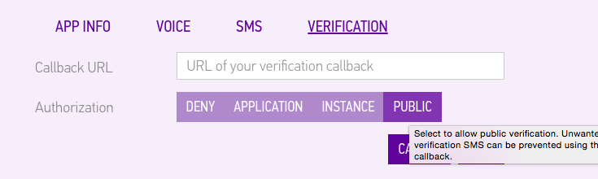
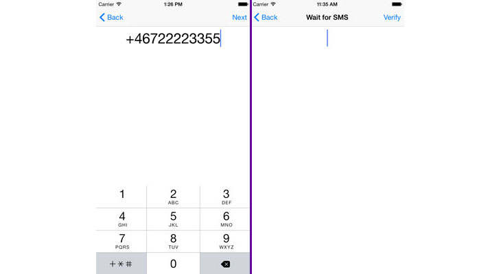

# Verify Phone Numbers with the Swift SDK using SMS

We recently made our first Swift SDK available for the [Sinch Verification product range](https://www.sinch.com/products/verification/). Before we dig into the Swift parts, let’s talk about verification and why you would want it. 

Our Verification product enables you to ensure that a user is in possession of a phone number by relying on the regular phone network to either send an SMS or make a call. 

Why would you use our SDK instead of rolling it yourself as we have showed in previous tutorials? 

- [Rails/Android Authentication](https://www.sinch.com/tutorials/ruby-on-rails-authentication/?utm_source=sinch&utm_medium=xlink&utm_campaign=verifytfrubyandroid1sinch)
- [C#/iOS](https://www.sinch.com/tutorials/building-a-c-authentication-system-with-net/?utm_source=sinch&utm_medium=xlink&utm_campaign=verifyauthcsharp1sinch)
- [C#/Web](https://www.sinch.com/tutorials/build-two-factor-authentication-system-pt-3/)
- [Build Your Own Magic One-Touch Login](https://www.sinch.com/tutorials/build-authenticator-app-sinch-otp-sharp/?utm_source=sinch&utm_medium=xlink&utm_campaign=verifyauthcsharp4sinch)
-[More Verification Tutorials](https://www.sinch.com/tutorials/?tags%5B%5D=verification&utm_source=sinch&utm_medium=xlink&utm_campaign=verifyall)

## We provide good value with our cloud SDK
1. We take care of the logic of re-tries
2. We automatically block spam numbers
3. We make sure re-tries are handled in a correct way
4. We are easy to use from you mobile app and just two simple callbacks to your backend to notify you about statuses of a verification
5. We support multiple ways of authentication (just for Android at the moment, but shortly arriving for iOS)
6. We are low cost because you don't need to rent any numbers on your own

Let’s stop talking and do some coding!

## The code
 
1. [Create an account](https://www.sinch.com/dashboard/#/signup)
2. Create an app and change enable verification (set it to public for now) 

3. Head over to [https://github.com/sinch/ios-swift-verification](https://github.com/sinch/ios-swift-verification) to download the repo.



There are some important bits to look at from a verification perspective in this app. One is the *EnterPhoneNumberViewController.swift* function:

```swift
@IBAction func startVerification(sender: AnyObject) {
    self.verification = SMSVerification(
    		applicationKey:"<yourkey>", 
    		phoneNumber: phoneNumber.text)
    self.verification!.initiate { 
    	(success: Bool, error: NSError?) 
    		-> Void in
            if (success)
            {
                self.performSegueWithIdentifier("verifySeg", sender:self)
            }
        }
    }
```
This function initiates an [SMS verification request](https://www.sinch.com/products/verification/sms-verification/) to the specified phone number (from the *viewcontroller*) and straight away gives you an indication if it’s on its way. In this case, I display an *EnterCodeViewController* and prompt the user to enter the code received in the SMS. 

```swift
@IBAction func verifyCode(sender: AnyObject) {
    verification?.verify(
    	code.text, 
    	completion: { 
    		(success:Bool, error:NSError?) -> Void in
            if (success)
            {
            	self.navigationController?.popToRootViewControllerAnimated(true)
            }
            else
            {
                //display some error message here
            }
            
        })
    }
```

In this simple sample app, I just pop to the root view controller, but you get an idea of how simple it is to integrate. 

For more information about using our Swift SDK, read about our [verification product](https://www.sinch.com/docs/verification/ios/).
