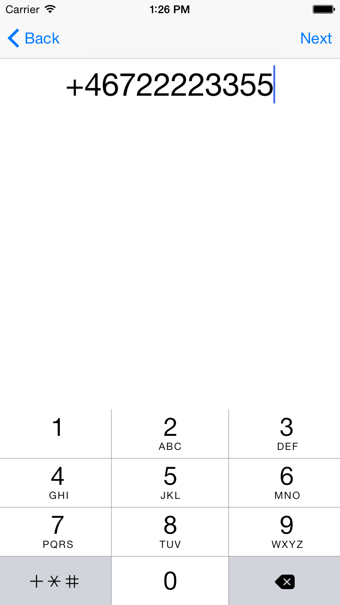
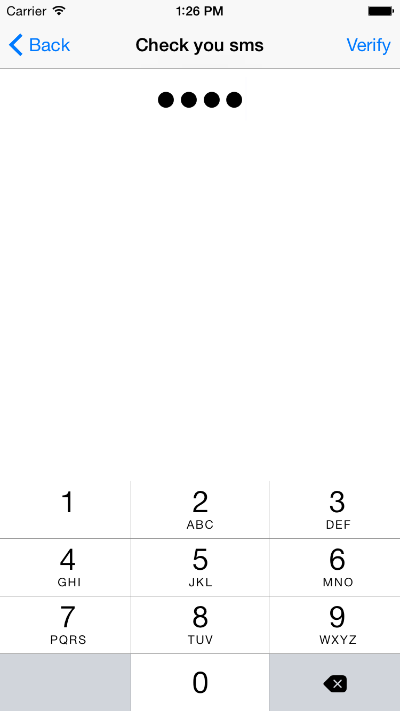

# Introducing our Verification Swift SDK

We have recently made our first Swift SDK available for the Verification SDK. Before we dig in to the Swift parts lets talk about verification and why you would want to do that. 

Our Verification product enables you to be sure that a user is in possession of a phone number by relying on the on regular phone network to either send an SMS or making a call. 

Why would you use our SDK instead of rolling it your self as we have showed in previous tutorials? 

- [Rails/Android part 1](https://www.sinch.com/tutorials/two-factor-authentication-rails/)
- [Rails/Android part 2](https://www.sinch.com/tutorials/ruby-two-factor-auth-part-2/)
- [Rails/Android part 3](https://www.sinch.com/tutorials/ruby-two-factor-auth-part-3/)
- [C#/iOS part 1](https://www.sinch.com/tutorials/build-two-authentication-system/)
- [C#/iOS part 2](https://www.sinch.com/tutorials/build-two-factor-authentication-system-pt-2/)
- [C#/web ](https://www.sinch.com/tutorials/build-two-factor-authentication-system-pt-3/)
- [Build your own magic one touch login](https://www.sinch.com/tutorials/build-authenticator-app-sinch-otp-sharp/)

## We provide some good value with our cloud SDK
1. We take care of the logic of retires
2. We automatically block spam numbers
3. We make sure retries are handled in a correct way
4. Easy to use from you mobile app, and just two simple callbacks to your backend to notify you about statuses of a verification.
5. Support for multiple ways of authentication (Just for Android at the moment, but shortly arriving for iOS)
6. Super low cost since you don't need to rent any numbers on your own. 

Lets stop talking and do some coding;

## The code
 
1. [Create an account](https://www.sinch.com/dashboard/#/signup)
2. Create an app, and change enable verification (set it to public for now) 

3. Head over to [https://github.com/sinch/ios-swift-verification]( https://github.com/sinch/ios-swift-verification) to download the bits.

<table>
<tr>
<td></td>
<td></td>
</tr>
</table>

The important bits to look at from a verification perspective in this app are two, in *EnterPhoneNumberViewController.swift* 

```swift
@IBAction func startVerification(sender: AnyObject) {
    self.verification = SMSVerification(
    		applicationKey:"<yourkey>", 
    		phoneNumber: phoneNumber.text)
    self.verification!.initiate { 
    	(success: Bool, error: NSError?) 
    		-> Void in
            if (success)
            {
                self.performSegueWithIdentifier("verifySeg", sender:self)
            }
        }
    }
```
This function initiates an SMS verification request to the specified phone number (from the *viewcontroller*) and straight away gives you an indication if it’s on its way. In this case, I display a *EnterCodeViewController* and prompt the user to enter the code received in the SMS. 

```swift
@IBAction func verifyCode(sender: AnyObject) {
    verification?.verify(
    	code.text, 
    	completion: { 
    		(success:Bool, error:NSError?) -> Void in
            if (success)
            {
            	self.navigationController?.popToRootViewControllerAnimated(true)
            }
            else
            {
                //display some error message here
            }
            
        })
    }
```

In this super simple sample app I just pop to the root view controller, but it gives you an idea how simple it is to integrate. 

For more information about using our Swift SDK, read about our [verification product]( https://www.sinch.com/docs/verification/ios/).